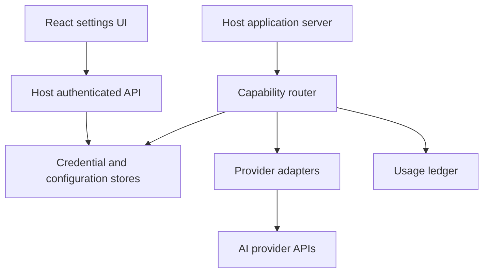

# AI Connections Development Plan

A development specification for Cursor to build a reusable bring your own AI connection system. The first release lets a developer declare AI capabilities, supported providers, user facing purposes, and model choice rules. It gives end users a settings screen for connecting providers, selecting models, reviewing application observed usage, and opening provider dashboards. The host application owns authentication, server deployment, and secure secret storage.

## 1. Product goal

Build an installable TypeScript package set that reduces the work required to add user supplied AI provider credentials to an application. A host developer installs the core package, the React UI package, and a server adapter. They define which capabilities the app uses and call the router by capability. A user connects a provider and chooses an allowed model for each capability.

The SDK must never imply that a declared capability restricts what a broad provider API key can do. The declaration controls only SDK routing and UI. The user must see that distinction.

### Primary users

- **Application developer:** declares features and provider choices; integrates server storage and authentication; invokes AI through a single router.
- **End user:** adds or removes their own connection, checks its purpose, chooses models, reviews observed usage, and follows links to official account pages.

### Success criteria for the first release

1. A sample app can integrate chat and image understanding with one configuration object, one settings component, and one server router.
2. OpenAI, Anthropic, and Google Gemini each work for supported capabilities through provider adapters. Capability support is verified against the actual adapter, rather than assumed from a marketing label.
3. A credential entered in the UI goes straight to the authenticated host server over HTTPS; it is never persisted in browser storage, logged, or returned from a read endpoint.
4. The app can select an allowed provider and model independently for chat and image understanding.
5. Each SDK mediated request produces a usage record and an estimated cost when enough usage and price data are available. Unknown cost is displayed as unknown.
6. A host developer can swap credential stores without changing the UI or router.

## 2. Release boundaries

### Version 0.1

- TypeScript core and React component library.
- Node server reference implementation, with one local development store and a production secret store contract.
- OpenAI, Anthropic, and Gemini provider adapters.
- Chat and image understanding (image input to a model), including nonstreaming requests first; streaming after the basic path is stable.
- Manual model catalog with tested model identifiers and a refreshable provider discovery hook where feasible. Show catalog freshness; never assume a listed model is enabled for every account.
- Provider connection flow, key replacement and deletion, a test connection action, per capability provider/model choices, purpose text, and official links.
- Per application usage ledger, estimate display, and optional alerts or best effort budget checks.
- Runnable example app and integration documentation.

### Later releases

Embeddings, generated images, speech, local Ollama, organization gateways, more UI frameworks, native platform credential stores, provider billing reconciliation, and hosted multi tenant infrastructure. These are extension points in 0.1, not promises of working features.

## 3. Architecture



All provider calls for a web application occur on the host server. The UI calls host endpoints with the application's normal user session. The server resolves that user to a tenant scoped credential, enforces the developer's allowlist, invokes an adapter, and records usage. The UI never receives a stored credential. Package code must not invent its own login system.

### Package layout

```text
packages/
  core/                 config schema, routing, provider interfaces, errors
  providers/            OpenAI, Anthropic, Gemini adapters
  react/                settings components and typed API client
  server/               endpoint handlers, store interfaces, auth context
  pricing/              versioned price catalog and estimator
examples/
  next-app/             complete reference app with tests
 docs/                   integration and threat model
```

Avoid putting server only modules into the React/browser package. Use explicit package exports so browser bundles cannot pull in credential code by accident.

## 4. Developer facing contract

The following illustrates the desired ergonomics; finalize names while implementing the typed API.

```ts
const config = defineAIConnections({
  appName: "Garage Assistant",
  capabilities: {
    chat: {
      description: "Answers questions about vehicle repairs.",
      providers: ["openai", "anthropic", "gemini"],
      userCanChooseModel: true,
      required: true,
    },
    vision: {
      description: "Analyzes photos you submit.",
      providers: ["openai", "gemini"],
      userCanChooseModel: true,
      required: false,
    },
  },
});

// In a server request handler after resolving the signed in user:
const result = await ai.forUser(authenticatedUserId).invoke({
  capability: "chat",
  input: [{ role: "user", text: "Explain this dashboard warning." }],
});

// In the host application's authenticated settings page:
<AIConnectionsSettings client={connectionsClient} />
```

Configuration is validated at startup. Unknown provider or capability values fail clearly. The host server passes a trusted user identity from its own auth middleware. Never accept a client supplied user ID as authorization.

### Core types

```ts
type Capability = "chat" | "vision";
type ProviderId = "openai" | "anthropic" | "gemini";

type ModelOption = {
  id: string;
  provider: ProviderId;
  capabilities: Capability[];
  displayName: string;
  catalogUpdatedAt: string;
};

type Selection = {
  capability: Capability;
  provider: ProviderId;
  modelId: string;
};

interface CredentialStore {
  put(scope: { tenantId: string; userId: string }, provider: ProviderId,
      plaintextKey: string): Promise<void>;
  get(scope: { tenantId: string; userId: string }, provider: ProviderId): Promise<string | null>;
  delete(scope: { tenantId: string; userId: string }, provider: ProviderId): Promise<void>;
}

interface ProviderAdapter {
  id: ProviderId;
  supportedCapabilities: readonly Capability[];
  testConnection(key: string): Promise<{ ok: boolean; reason?: string }>;
  listModels(key: string): Promise<ModelOption[]>;
  invoke(request: ProviderRequest, key: string): Promise<ProviderResult>;
}
```

ProviderRequest and ProviderResult must normalize basic input, output, request status, provider request ID, latency, and reported usage. Preserve provider specific metadata in a namespaced field without leaking credentials. State explicitly where a provider cannot supply a usage field.

### Server endpoints in the reference app

| Method | Route | Purpose |
| --- | --- | --- |
| GET | `/api/ai/connections` | Return allowed providers, connection status, purposes, links, and current selections; never secrets. |
| PUT | `/api/ai/connections/:provider` | Create or replace a key for the authenticated user. |
| DELETE | `/api/ai/connections/:provider` | Revoke the stored connection locally. |
| POST | `/api/ai/connections/:provider/test` | Test a submitted or stored key with throttling. |
| GET | `/api/ai/models?capability=...` | Return allowed, compatible models with availability caveats. |
| PUT | `/api/ai/selections/:capability` | Validate and save a user's allowed provider and model. |
| GET | `/api/ai/usage?from=...&to=...` | Return the user's application observed ledger summary. |

State changing routes need session authentication, authorization, CSRF protection when cookie authenticated, request size limits, and rate limits. Errors should use stable codes and safe messages. No endpoint accepts an arbitrary provider URL in the first release.

## 5. Credential and privacy design

A generic SDK cannot guarantee encryption merely by calling a method named `encrypt`. The host provides a credential store backed by an appropriate secrets service or envelope encryption with externally managed keys. The reference server should include an encrypted development implementation that uses a separately supplied master key, and documentation for a production implementation. Do not commit keys, the master key, or plaintext fixtures.

- Scope every secret and setting by authenticated tenant and user. Define account sharing as a separate future feature.
- Send key submission only over HTTPS outside local development. Keep plaintext in memory only for the call that requires it.
- Do not place secrets in URLs, browser storage, analytics events, exceptions, traces, logs, screenshots, or UI state persistence. The input is cleared after a successful save.
- Provide a masking status such as “Connected” without exposing suffixes unless necessary. Support replacement and deletion; explain that local deletion does not revoke a provider issued key.
- Protect key test and model discovery from unlimited provider calls. Sanitize upstream error text before showing it.
- Use provider SDKs or documented HTTPS endpoints with TLS verification; set timeouts and conservative retries only for safe failure modes.
- Explicitly document the trust boundary: a host application whose server holds a user's key can use it outside this SDK. The SDK cannot cryptographically prevent host misuse. Users should be directed to provider side spending and key controls where offered.

## 6. Routing and model selection

1. Receive a capability request in authenticated server code.
2. Load the developer's capability policy and user's saved selection.
3. Verify the provider is allowlisted, adapter supports the capability, model is compatible, and credential exists.
4. Apply request limits and optional budget policy.
5. Send the normalized request through the provider adapter.
6. Record result or safe failure metadata, including provider reported usage if available.
7. Return normalized output; never silently fall back to another provider unless the developer explicitly enables and explains that behavior.

A model may disappear or become unavailable for one account. Return a recoverable `MODEL_UNAVAILABLE` error and show a selection action. Do not silently switch models. Separate model catalog data from pricing data; update each on its own schedule and record the version used in estimates.

## 7. Usage, cost, and budgets

The ledger covers requests routed through this SDK in this application. It is not an authoritative provider account statement and cannot see calls made elsewhere. Store time, tenant/user IDs, capability, provider, model, outcome, latency, provider request ID where available, usage units, price catalog version, estimated cost, and estimation status. Never store prompts or response content in the ledger by default.

Compute costs from reported usage and versioned prices when available. Include relevant input, output, cache, image, or other units only when supported by that adapter and price entry. If usage or price is absent, show “Cost unavailable,” not zero. The UI labels totals “Estimated in this app” and links to the provider dashboard for account level billing. Keep official links in a curated registry and review them periodically.

Budget warnings and hard limits require qualification. A check made before a call cannot know final token usage; concurrent requests can cross a threshold. For 0.1, implement threshold warnings and optional best effort preflight blocking based on observed spend, and expose request token/output caps where supported. Do not claim a guaranteed spending cap. Recommend provider side limits where available.

## 8. Settings experience

The settings page has four sections:

1. **Purpose and connections:** show why each capability uses AI, allowed providers, status, a link to obtain a key, a password style input, test, save, replace, and remove actions. Include clear text explaining who receives submitted content and that the host app operates the key.
2. **Model choices:** show one selection per capability, filtered to connected and compatible providers. Mark unavailable choices and explain why.
3. **Usage:** show requests, units, and estimated cost for a chosen period. Link to provider usage and billing pages with a note that provider totals may differ.
4. **Controls:** show developer enabled model and budget options, limits, and error states.

Provide keyboard accessible controls, labels, loading states, and useful error recovery. Do not show fake usage data in production. A key test may consume quota; disclose that before sending it if the provider test requires a billable request.

## 9. Implementation phases for Cursor

### Phase 1 Foundation

Create a monorepo with strict TypeScript, package exports, linting, unit tests, and the example app. Define schemas, provider registry, capability policy validation, normalized errors, and store interfaces. Deliver a minimal mock provider to prove routing without real credentials.

**Done when:** the example app configures chat and vision, a mock router call succeeds, invalid provider/model combinations fail, and browser imports exclude server modules.

### Phase 2 Secure connection flow

Implement authenticated reference endpoints, tenant/user scoping, encrypted development store, production store contract, key replacement/deletion, connection status, and safe key tests. Add threat model and deployment instructions.

**Done when:** cross user reads and writes are rejected, secrets never appear in responses or logs, and key removal makes subsequent invocation fail safely.

### Phase 3 Provider adapters and selections

Implement and verify OpenAI, Anthropic, and Gemini adapters for chat and image understanding where supported. Add normalized usage, manual tested model catalog, optional discovery, selection validation, and distinct errors for invalid key, unsupported model, rate limit, and upstream outage.

**Done when:** contract tests pass with mocked HTTP for all adapters and opt in live smoke tests pass with developer supplied test keys.

### Phase 4 React settings UI

Build connection cards, purpose text, official links, credential actions, per capability model selectors, usage screen, and accessible loading/error states. The UI uses the host server client only.

**Done when:** a sample user can connect a key, select a valid model, make a request, inspect usage, and remove the key.

### Phase 5 Ledger and release

Implement request event persistence, versioned price estimates, unknown cost behavior, basic alerts, and best effort budget checks. Finish integration guide, API reference, sample deployment, security review, and package release workflow.

**Done when:** repeated requests generate accurate observed counts, estimate labels distinguish known and unknown data, and the sample app works from the published packages.

## 10. Verification matrix

| Area | Essential checks |
| --- | --- |
| Policy | Disallowed provider/model/capability; changed config invalidates selection safely. |
| Isolation | User A cannot list, use, change, or delete User B's credentials or selections. |
| Secrets | API responses, logs, errors, telemetry, and browser storage contain no provider key. |
| Providers | Each adapter maps request, response, usage, timeout, rate limit, and error behavior correctly. |
| Usage | Successful, failed, streamed, and unknown price calls yield the expected ledger state. |
| Budgets | Concurrent requests demonstrate documented best effort behavior. |
| UI | Keyboard flow, screen reader labels, empty/loading/error states, and narrow viewport. |
| Packaging | Clean install of published artifacts in the sample app; no server secret imports in browser output. |

Use mock provider tests in continuous integration. Keep real provider smoke tests opt in to avoid charges and dependency on live availability.

## 11. Initial Cursor task

Paste the following into Cursor with this document in the project root:

> Read `AI_Connections_Development_Plan.md` completely. Implement Phase 1 only. Start by creating the monorepo, typed configuration schema, core provider interface, mock adapter, capability router, normalized errors, and runnable example app. Follow the package boundaries and acceptance criteria in the document. Show the proposed file tree before major edits. Do not implement real credential persistence or call paid provider APIs in this phase. Run the relevant typecheck, lint, and tests; then summarize what works, files changed, and what Phase 2 needs.

After reviewing Phase 1, ask Cursor to implement the next phase against this document. Keep provider identifiers and current provider endpoint details in code and test them against official documentation at implementation time; those details change independently of this specification.
